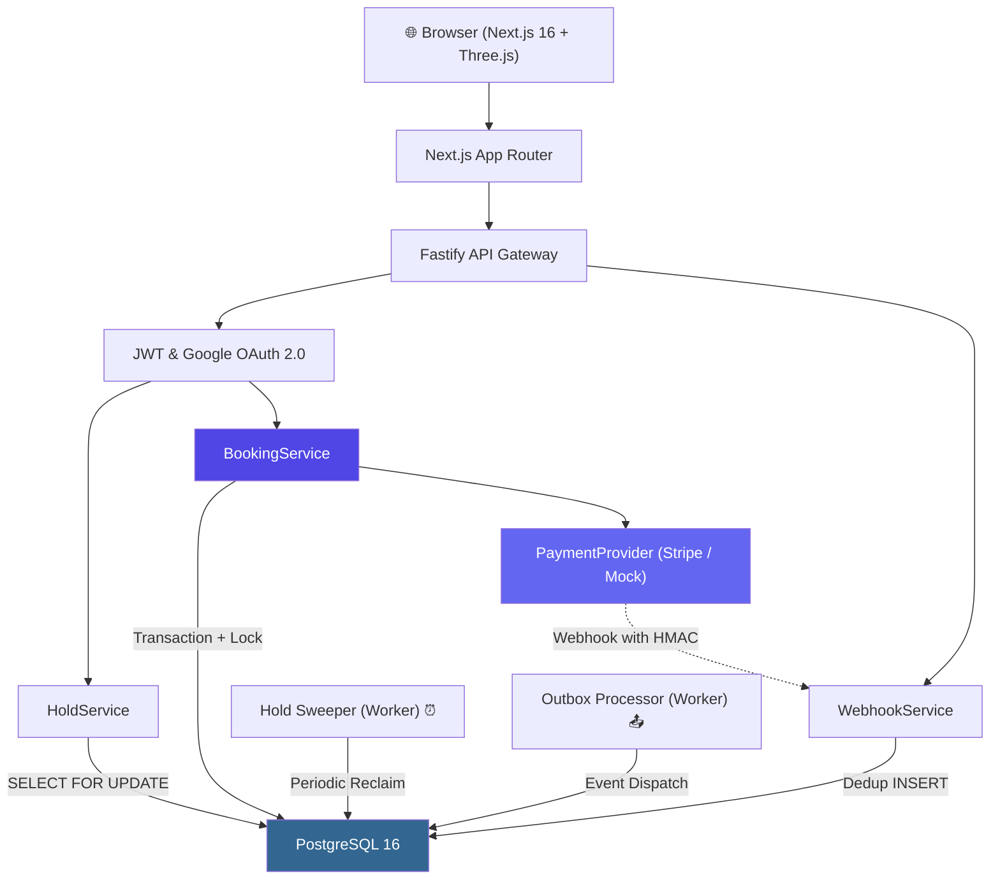

# SeatLock — Production-Grade Event Booking System

> **Core Database Invariant:** For every `(event_id, seat_id)`, at most **one** booking may have `status = 'CONFIRMED'`.
> This is enforced by a PostgreSQL partial unique index at the storage engine layer — not application code.

SeatLock is an industrial-grade, production-style distributed event ticketing and seat reservation platform engineered to eliminate race conditions, double-bookings, phantom inventory, webhook duplicates, and payment inconsistencies under extreme concurrent load.

---

## Key Highlights & Features

- 🛡️ **Pessimistic Row-Level Locking**: `SELECT ... FOR UPDATE` serializes concurrent transactions at the database storage engine.
- ⚡ **Database-Enforced Invariant**: Partial unique index (`CREATE UNIQUE INDEX ... WHERE status = 'CONFIRMED'`) guarantees zero double-bookings even if application code fails.
- 💳 **Stripe Payment Gateway Integration**: Real Stripe SDK integration with PaymentIntents, test card auto-fill, and HMAC webhook signature verification.
- 🔐 **Google OAuth 2.0 Authentication**: Cryptographic token verification via `google-auth-library`, automatic user provisioning, and popup sign-in.
- 🏟️ **Three.js 3D Stadium Visualizer**: Interactive 3D arena view with volumetric stage lighting, tiered seating arcs, orbit controls, and tier selection.
- 🎫 **3D Holographic Tilt Ticket**: Real-time cursor-reactive 3D perspective ticket with metallic holographic glare and QR verification.
- 🔁 **Idempotent Settlement & Outbox Pattern**: Exactly-once payment retries and transactional outbox events within atomic database transactions.
- 🧪 **11 Critical Concurrency Tests**: Automated test suite simulating 100 concurrent threads competing for the same seat, network retries, and webhook replays.

---

## System Architecture



---

## Technology Stack

| Layer | Technology | Engineering Rationale |
|---|---|---|
| **Frontend** | Next.js 16 (App Router), TypeScript, Vanilla CSS, TailwindCSS | Modern React server & client components with streaming |
| **3D & Animation** | Three.js, Framer Motion, canvas-confetti, Lucide | Real-time 3D stadium visualizer, holographic tilt cards |
| **Backend** | Fastify, TypeScript, Zod | Schema-validated, low-overhead HTTP engine |
| **Database** | PostgreSQL 16 | ACID transactions, row-level locks, partial unique indexes |
| **Caching / Queues** | Redis 7 | Distributed locking, session cache, task coordination |
| **Payments** | Stripe SDK + Mock Sandbox | Dual-mode provider pattern with webhook deduplication |
| **Authentication** | Google OAuth 2.0 (`google-auth-library`), bcrypt, JWT | Secure verification, zero client trust, role-based RBAC |
| **Testing** | Vitest, Autocannon | Fast, TypeScript-native concurrency & load test suites |
| **Infrastructure** | Docker Compose | Reproducible PostgreSQL 16 & Redis 7 containers |

---

## Concurrency & Consistency Strategy

### 1. Row-Level Mutex (`SELECT ... FOR UPDATE`)
```sql
SELECT * FROM seats 
WHERE id = $1 AND event_id = $2 
FOR UPDATE;
```
Concurrent requests queue on the row lock. The winner acquires the 10-minute hold lease; all competing threads observe the active hold and immediately receive `409 Conflict`.

### 2. Storage Engine Invariant (Partial Unique Index)
```sql
CREATE UNIQUE INDEX idx_bookings_confirmed_seat 
ON bookings (event_id, seat_id) 
WHERE (status = 'CONFIRMED');
```
Guarantees that regardless of server restarts, application bugs, or network retries, the database physically prevents two confirmed bookings for the same seat.

### 3. Webhook Deduplication
```sql
INSERT INTO webhook_events (provider_event_id, event_type, payload) 
VALUES ($1, $2, $3)
ON CONFLICT (provider_event_id) DO NOTHING;
```
Idempotent webhook pipeline: Delivery #1 processes and confirms the payment; deliveries #2–N return `200 OK` as no-ops.

---

## Quick Start

### Prerequisites
- Node.js 20+
- Docker Desktop (for PostgreSQL & Redis)

### 1. Start Infrastructure
```bash
docker compose up -d
```

### 2. Install Dependencies
```bash
npm install
```

### 3. Run Migrations & Seed Database
```bash
npm run db:migrate
npm run db:seed
```

### 4. Configure Environment
Copy [`.env.example`](.env.example) to `.env`:
```bash
cp .env.example .env
```
*(Optional: Add your own `STRIPE_SECRET_KEY` and `GOOGLE_CLIENT_ID` for live test accounts).*

### 5. Start Development Servers
```bash
# Terminal 1: Backend API (http://localhost:3001)
npm run dev:backend

# Terminal 2: Frontend UI (http://localhost:3000)
npm run dev:frontend
```

**Pre-seeded Demo Accounts:**
- **Admin**: `admin@seatlock.dev` / `admin123`
- **User**: `alice@example.com` / `user123`
- **Google 1-Click**: Click "Continue with Google" on `/login` or `/register`

---

## Automated Concurrency Test Suite

The critical concurrency test suite proves database and transactional integrity under simulated race conditions:

```bash
npm run test:concurrency
```

### Verified Test Cases (11/11 Passed)

| Test Case | Invariant Verified |
|---|---|
| **TEST 1** | **100 concurrent hold attempts** for the same seat → exactly 1 succeeds, 99 return `409 Conflict`, 0 server errors |
| **TEST 2** | Partial unique index rejects double `CONFIRMED` booking attempts |
| **TEST 3** | Same `Idempotency-Key` header returns cached response without duplicate charges |
| **TEST 4** | Different idempotency keys safely create separate distinct bookings |
| **TEST 5** | Webhook replay deduplication: 3 deliveries → 1 processed, 2 no-ops |
| **TEST 6** | Expired hold automatically unblocks inventory for other users |
| **TEST 7** | User B cannot confirm or access User A's seat hold |
| **TEST 8** | Explicit hold release immediately frees seat for competing users |
| **TEST 9** | Transaction rollback on payment failure leaves zero orphan or partial records |
| **TEST 10** | Payment provider timeout + retry creates only 1 booking |
| **TEST 11** | Different seats can be acquired concurrently without false serialization (260ms) |

---

## Security & Anti-Hack Hardening

1. **Price Tampering Protection**: The client never specifies the price. All amounts are read directly from PostgreSQL row data under `FOR UPDATE` lock.
2. **Secret Key Isolation**: `STRIPE_SECRET_KEY` and `GOOGLE_CLIENT_SECRET` reside strictly on the server and are never bundled into client JavaScript.
3. **Cryptographic Token Verification**: Google ID tokens are verified against Google's public certificates via `google-auth-library` checking `audience`, `issuer`, and `email_verified`.
4. **Bcrypt Password Hashing**: Passwords salted with 10 rounds; password hashes cached during batch testing to prevent CPU thread starvation.
5. **Rate Limiting & Input Validation**: `@fastify/rate-limit` DDoS protection and strict Zod runtime schemas on all endpoints.

---

## Project Structure

```
seatlock/
├── docker-compose.yml              # PostgreSQL 16 + Redis 7
├── docs/                           # Architecture, Concurrency, and Runbooks
│   ├── architecture.md
│   ├── concurrency.md
│   ├── failure-modes.md
│   ├── idempotency.md
│   └── load-testing.md
├── packages/
│   ├── backend/
│   │   ├── src/
│   │   │   ├── db/                 # Migrations, pool, and seed data
│   │   │   ├── middleware/         # JWT Auth, rate limiting, error handlers
│   │   │   ├── providers/          # Stripe & Mock payment providers
│   │   │   ├── repositories/       # Isolated PostgreSQL query layers
│   │   │   ├── routes/             # REST endpoints (Zod validated)
│   │   │   ├── services/           # Business logic (Auth, Hold, Booking, Webhook)
│   │   │   └── workers/            # Hold sweeper & transactional outbox processor
│   │   └── tests/
│   │       ├── concurrency/        # Vitest 100-thread concurrency test suite
│   │       └── load/               # Autocannon load benchmark script
│   └── frontend/
│       └── src/
│           ├── app/                # Next.js App Router (Home, Events, Checkout, Admin)
│           ├── components/         # Three.js 3D Arena, 3D Hologram Ticket, Stripe Form
│           └── lib/                # API client, Auth Context, utilities
└── README.md
```

---

## License
MIT License. Built for Staff-Level Engineering Demonstration.
