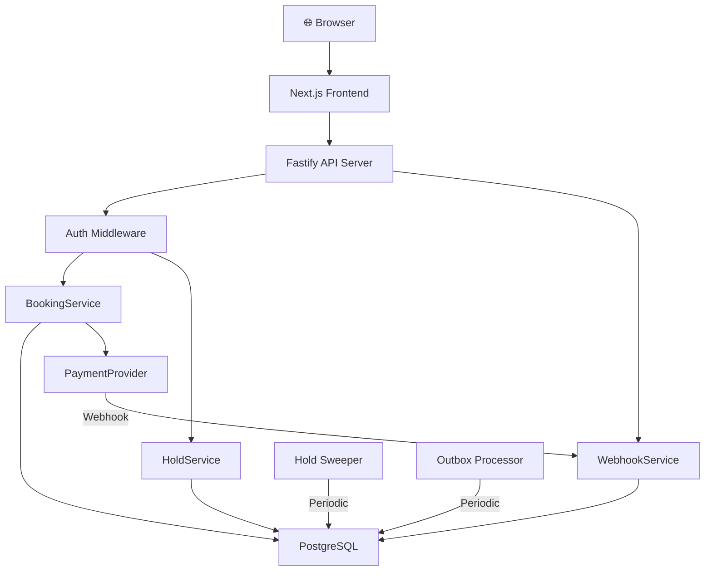

# Architecture

## System Overview

SeatLock is a production-grade event booking system built to demonstrate correctness under concurrency, race conditions, payment retries, and failure scenarios.



## Layers

```
Frontend (Next.js + React)
    │
    ▼
API Routes / Controllers (Fastify)
    │ ← Zod Validation, Auth Middleware, Rate Limiting
    ▼
Application Services
    │
    ├── BookingService   — booking confirmation + idempotency
    ├── HoldService      — transactional seat holds
    ├── WebhookService   — webhook deduplication
    ├── AuthService      — registration, login, JWT
    │
    ▼
Repositories (Data Access Layer)
    │
    ├── BookingRepository
    ├── SeatRepository   — includes SELECT ... FOR UPDATE
    ├── HoldRepository   — includes point-of-use expiration
    ├── PaymentRepository
    ├── WebhookRepository
    ├── OutboxRepository
    │
    ▼
PostgreSQL
    │
    ├── Transactions (serialized seat access)
    ├── Row-level locks (FOR UPDATE)
    ├── Partial unique index (one_booking_per_seat)
    ├── UNIQUE constraints (idempotency_key, provider_event_id)
    └── Outbox table
```

## Background Processing

```
PostgreSQL
    │
    ├── Hold Sweeper (30s interval)
    │   └── Releases expired holds, updates seat status
    │
    └── Outbox Processor (5s interval)
        └── Marks transactional events as published
```

## Payment Flow

```
BookingService
    │
    ▼
PaymentProvider Interface
    │
    ├── MockPaymentProvider (dev/test)
    │   ├── Simulates success
    │   ├── Simulates failure
    │   └── Simulates timeout
    │
    └── (Future) StripeProvider
```

## Key Design Decisions

### Why PostgreSQL (not MongoDB/Redis)?
The core invariant requires transactional guarantees, row-level locking, and database-enforced constraints. PostgreSQL provides all three. MongoDB cannot enforce a partial unique index in the same way. Redis cannot guarantee transactional consistency with durable state.

### Why SELECT ... FOR UPDATE (not application mutex)?
An application mutex only works on a single server instance. With multiple API servers, the lock would need to be distributed (e.g., Redis lock). PostgreSQL row-level locks are:
- Automatically distributed across all connections
- Released on transaction commit/rollback
- Deadlock-detected by the database
- Scoped to exactly the row needed (no global serialization)

### Why a partial unique index (not application-level check)?
Application checks can be bypassed by bugs, race conditions, or direct database access. The partial unique index is enforced by PostgreSQL itself:
```sql
CREATE UNIQUE INDEX one_booking_per_seat
  ON bookings(event_id, seat_id)
  WHERE status = 'CONFIRMED';
```
This means even if every line of application code is wrong, the database still prevents double booking.

### Why manual dependency injection (not a DI container)?
The service graph is small and the wiring is explicit. A DI container would add complexity without proportional benefit at this scale. The explicit wiring in `server.ts` makes the dependencies visible and testable.
